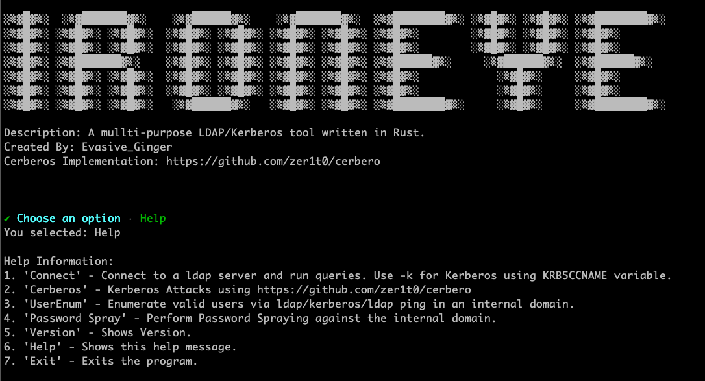
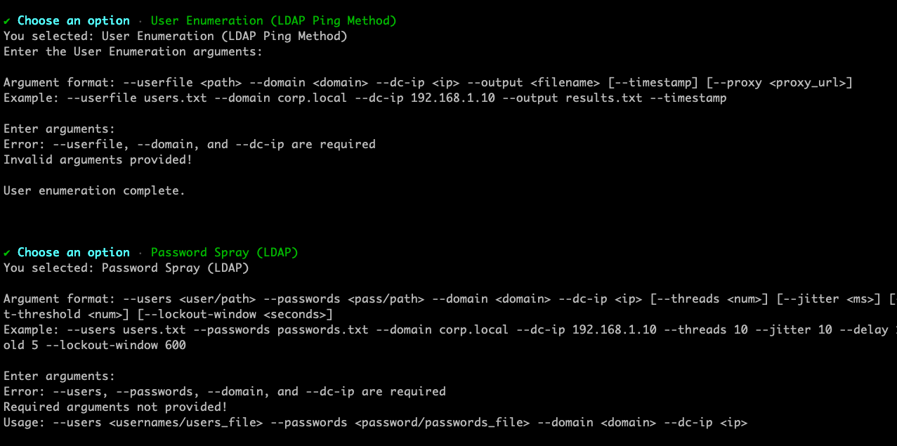

# IronEye

IronEye is a Rust-based Active Directory enumeration and security assessment tool designed for use in internal network environments. It enables penetration testers, red teamers, and security researchers to interact with LDAP, Kerberos, and SMB services efficiently.
The tool supports both password and Kerberos authentication, allowing for credentialed LDAP queries, password spraying, TGT requests, and more.

## Install and Compile
```bash
cargo build --release
```

## Connect Module
Authenticate using password
```bash
-u tywin.lannister -p powerkingftw135 -d SEVENKINGDOMS.LOCAL -i 10.2.10.10
```
Authenticate using Kerberos to LDAPS

Note: Youll need to set up the KDC realm usually found at /etc/krb5.conf. A sample is provided. 
```bash
-u robb.stark -d NORTH.SEVENKINGDOMS.LOCAL -i WINTERFELL.NORTH.SEVENKINGDOMS.LOCAL -k -s
```
Connection Arguments:
```
-u <user> -p <password> -d <domain -i <FQDN/IP> [-s <ldaps>] [-t <timestamp>] [-k <Kerberos Auth>]
```




## Connect - Sub Modules


- **Get SID/GUID** - Get the SID/GUID of a domain object
- **From SID/GUID** - Find the CN/Name of a SID/GUID
- **Get SPNs** - Pull and export all domain SPNs
- **Query Groups** - Pull groups for a user or all user groups
- **Machine Quota** - Get the MAQ for the domain
- **Net Commands** - Net User/Group commands
- **Password Policy** - Pull the domain password poilicies including fine-grained ones
- **Deep-Queries** - Quereies for interesting domain assets or information
- **Custom Ldap** - Run a custom LDAP query

## Cerberos Module
Refer to https://github.com/zer1t0/cerbero for usage details/examples.
```bash
Kerberos protocol attacker

USAGE:
    cerbero <SUBCOMMAND>

FLAGS:
    -h, --help       Prints help information
    -V, --version    Prints version information

SUBCOMMANDS:
    ask           Ask for tickets
    asreproast    Perform a asreproast attack
    brute         Perform a bruteforce attack against kerberos protocol
    convert       Converts tickets files between ccache and krb
    craft         Create golden and silver tickets
    hash          Calculate password hashes/Kerberos keys
    help          Prints this message or the help of the given subcommand(s)
    kerberoast    Perform a kerberoast attack
    list          Describe the credentials stored in a file
    export        Export file to KRB5CCNAME variable. (export /path/to/file.ccache)
```


## User Enumeration / Password Spray Modules
User Enumeration:
```
Argument format: --userfile <path> --domain <domain> --dc-ip <ip> --output <filename> [--timestamp]
Example: --userfile users.txt --domain corp.local --dc-ip 192.168.1.10 --output results.txt --timestamp
```

Password Spray:
```
Argument format: --users <user/path> --passwords <pass/path> --domain <domain> --dc-ip <ip> [--threads <num>] [--jitter <ms>] [--delay <ms>] [--continue-on-success] [--verbose] [--timestamp] [--proxy <proxy_url>] [--lockout-threshold <num>] [--lockout-window <seconds>]
Example: --users users.txt --passwords passwords.txt --domain corp.local --dc-ip 192.168.1.10 --jitter 10 --delay 10 --continue-on-success --verbose --timestamp  --lockout-threshold 5 --lockout-window 600
```


## Current / Future Development

| Feature           | Description                                  | Status   |
|------------------|----------------------------------|---------|
| Kerberos Auth   | Supports Kerberos-based authentication | ✅ Working |
| Proxy Support   | While native SOCKS support is desired, this tool works well with proxychains4.       | ❌ TBD  |
| Multi-Platform  | Works on Linux, macOS, Windows    | ✅ Tested  |
| Password Spray Threading | Thrading to be implemented    | ❌ TBD |
